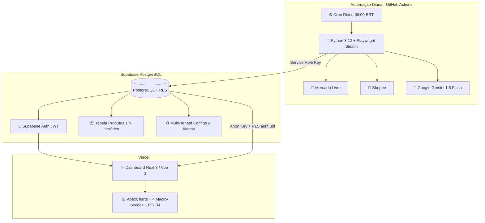

# 🚀 E-Commerce Market Intelligence & AI Analytics SaaS

> Plataforma SaaS de **Inteligência Competitiva e Análise de Mercado para E-Commerce** (Mercado Livre e Shopee), com scraping automatizado na nuvem (GitHub Actions), banco de dados **Multi-Tenant (Supabase)** com Row Level Security (RLS) e diagnósticos preditivos via **Google Gemini AI**.

---

## 🏛️ Arquitetura do Sistema (100% Custo Zero / Serverless)



---

## ✨ Principais Funcionalidades

1. **🏢 Arquitetura Multi-Tenant com RLS:**
   - Cada cliente/inquilino (*tenant*) possui seu próprio isolamento de dados no Supabase via Row Level Security (`auth.uid() = user_id`).
   - Um cliente monitorando *Informática/Games* nunca acessa os produtos de outro cliente monitorando *Artesanato/Biscuit*.

2. **🤖 Scraping Autônomo na Nuvem (GitHub Actions):**
   - Agendamento diário automático às `06:00 BRT` sem exigir que o computador do cliente fique ligado.
   - Restauração de cookies de sessão autenticados (`AUTH_MELI_JSON` e `AUTH_SHOPEE_JSON`) para contornar proteções anti-bot/WAF.
   - **Sistema de Alerta Anti-Bot:** Se encontrar Captcha, tira screenshot, salva nos artefatos de debug e notifica o Dashboard do usuário sem interromper a execução.

3. **🧠 Diagnóstico Executivo com IA (Google Gemini 1.5 Flash):**
   - Categorização automática em linguagem natural.
   - Geração de relatório executivo bilíngue (PT 🇧🇷 / EN 🇺🇸) cobrindo:
     - 🏆 *Top Vendedores & Lojas Líderes*
     - 🔥 *Produtos Virais & Aceleração de Vendas*
     - 🏷️ *Faixas de Preço e Sweet Spots de Lucro*
     - ⚔️ *Batalha de Plataformas (Mercado Livre vs Shopee)*

4. **📊 Dashboard Analítico Ultra-Fluido (Nuxt 3 + Vue 3):**
   - **Hierarquia Visual em 4 Macro-Seções Temáticas:**
     - 🟣 *Seção 1: Inteligência Executiva de IA*
     - 🟢 *Seção 2: Desempenho Financeiro & KPIs com descrições didáticas*
     - 🔵 *Seção 3: Mapeamento Visual de Concorrência (ApexCharts)*
     - 🔍 *Seção 4: Catálogo Operacional de Anúncios com busca e exportação CSV*
   - **Linha do Tempo (Time Machine):** Navegação por qualquer data passada ou comparação lado a lado (Data A vs Data B).
   - **Internacionalização Dinâmica:** Alternância instantânea de idioma entre Português 🇧🇷 e Inglês 🇺🇸.

---

## 📂 Estrutura de Diretórios Organizada

```text
biscuit_scraper/
│
├── .github/
│   └── workflows/
│       ├── daily_scrape.yml         # ⏰ Workflow Diário Cron & Manual no GitHub Actions
│       └── deploy_frontend.yml      # 🚀 CI/CD de deploy do Frontend
│
├── frontend/                        # 💻 Dashboard SaaS em Nuxt 3 (Vue 3)
│   ├── assets/css/main.css          # Design System Glassmorphism & Tokens
│   ├── components/                  # Componentes Vue 3 Modulares
│   │   ├── AiExecutiveReport.client.vue  # Relatório Executivo com Gemini AI
│   │   ├── AntiBotAlert.vue         # Banner de Notificação de Status Anti-Bot
│   │   ├── CategoryVolumeChart.client.vue # Gráfico de Volume por Categoria
│   │   ├── DataTable.vue            # Tabela de Anúncios com Infinite Scroll
│   │   ├── KpiCards.vue             # Cards Financeiros com Legendas Didáticas
│   │   ├── Navbar.vue               # Barra Superior com Sessão & Logout
│   │   ├── PriceRangeHistogramFilter.vue # Histograma Range Slider
│   │   ├── PriceStrategyMonitor.vue # Monitor de Aumento vs Guerra de Preços
│   │   ├── TopProductsChart.client.vue # Top 10 Produtos Mais Vendidos
│   │   ├── TopSellersChart.client.vue # Top Lojas e Concorrentes
│   │   └── TrendingProductsTab.vue  # Ranking de Velocidade e Aceleração
│   ├── composables/                 # Composables Reativos
│   │   ├── useAppI18n.ts            # Dicionário Bilíngue Reativo (PT / EN)
│   │   └── useSupabase.ts           # Singleton Supabase com persistência de sessão
│   ├── middleware/
│   │   └── auth.global.ts           # 🛡️ Guarda Global de Rotas (Redireciona para /login)
│   ├── pages/
│   │   ├── index.vue                # Painel Principal do Dashboard
│   │   └── login.vue                # 🔐 Tela de Login com Glassmorphism
│   └── nuxt.config.ts               # Configuração do Nuxt 3 e módulos
│
├── database/                        # 🗄️ Scripts SQL, Migrações e Políticas de RLS
│   └── database_setup.sql           # 📄 Script SQL com Tabelas, Índices e RLS
│
├── backend/                         # 🐍 Engine de Scraping & IA em Python
│   ├── main.py                      # Ponto de Entrada CLI (--daily-cron / --plataforma)
│   ├── config.py                    # Gerenciador de Parâmetros e Pastas
│   ├── ai/
│   │   ├── categorizer.py           # Classificador de Categorias por IA
│   │   └── insights_generator.py    # Gerador de Insights Estatísticos
│   ├── scrapers/
│   │   ├── login_session.py         # Inicializador de Sessão Chrome Real (Bypass WAF)
│   │   ├── meli_scraper.py          # Pipeline Medalhão do Mercado Livre
│   │   └── shopee_scraper.py        # Pipeline Medalhão da Shopee
│   └── utils/
│       ├── ai_engine.py             # Integração com Google Gemini API
│       ├── bot_detector.py          # Verificador de Captcha e Bloqueios
│       ├── relevancia.py            # Filtro de Palavras-Chave e Blacklist
│       └── supabase_client.py       # Cliente Supabase & Gravação de Séries Temporais
│
├── data/                            # 📁 Armazenamento Local (Bronze/Prata/Ouro/Auth)
├── requirements.txt                 # Dependências do Python
└── README.md                        # Documentação Oficial
```

---

## ⚡ Guia de Inicialização Rápida

### 1. Configuração do Banco de Dados (Supabase)
1. Crie um projeto gratuito no [Supabase](https://supabase.com/).
2. Abra o **SQL Editor** no painel do Supabase.
3. Cole e execute o arquivo [`database/database_setup.sql`](database/database_setup.sql) para criar as tabelas, índices e políticas de segurança RLS.
4. Em **Authentication ➔ Users**, crie o seu primeiro usuário com e-mail e senha.

### 2. Rodando o Frontend Localmente
```bash
cd frontend
npm install
npm run dev
```
Acesse no seu navegador: **`http://localhost:3000`** (Faça o login com as credenciais do Supabase).

### 3. Gerando Cookies de Login para o Robô da Nuvem (Opcional - Feito 1 vez)
Para que o robô no GitHub Actions navegue como um usuário logado:
```bash
python backend/main.py --login
```
Faça o login nas janelas reais do Chrome que abrirem (Mercado Livre e Shopee). Os cookies serão salvos em `data/auth/auth_meli.json` e `data/auth/auth_shopee.json`.

---

## 🔑 Configuração de Segredos no GitHub Actions

No seu repositório no GitHub, vá em **Settings ➔ Secrets and variables ➔ Actions ➔ New repository secret** e cadastre:

| Secret | Descrição |
| :--- | :--- |
| `SUPABASE_URL` | URL do seu projeto Supabase (`https://xxxx.supabase.co`) |
| `SUPABASE_SERVICE_ROLE_KEY` | Chave secreta `service_role` (ignora RLS no scraping na nuvem) |
| `GEMINI_API_KEY` | Chave do Google Gemini API (Google AI Studio) |
| `AUTH_MELI_JSON` | Conteúdo do arquivo `data/auth/auth_meli.json` |
| `AUTH_SHOPEE_JSON` | Conteúdo do arquivo `data/auth/auth_shopee.json` |

---

## 📄 Licença
Distribuído sob a licença MIT. Consulte `LICENSE` para mais detalhes.
