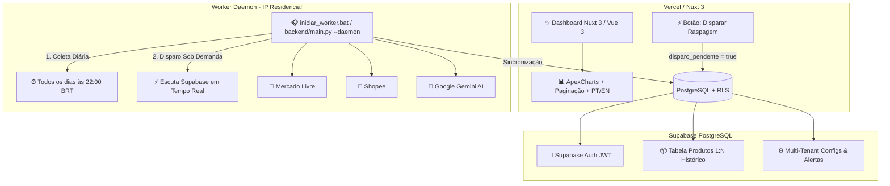

# 📈 MarketPulse AI — E-Commerce Market Intelligence SaaS

> Plataforma SaaS de **Inteligência Competitiva e Análise de Mercado para E-Commerce** (Mercado Livre e Shopee), com Worker de Extração Local (IP Residencial livre de WAF), banco de dados **Multi-Tenant (Supabase)** com Row Level Security (RLS) e diagnósticos preditivos via **Google Gemini AI**.

---

## 🏛️ Arquitetura do Sistema



---

## ✨ Principais Funcionalidades

1. **🏢 Arquitetura Multi-Tenant com RLS:**
   - Cada cliente/inquilino (*tenant*) possui seu próprio isolamento de dados no Supabase via Row Level Security (`auth.uid() = user_id`).
   - Um cliente monitorando *Informática/Games* nunca acessa os produtos de outro cliente monitorando *Artesanato/Biscuit*.

2. **🎧 Worker Daemon Local com IP Residencial (Zero Bloqueios WAF):**
   - **Agendamento Diário Automático:** Executa todos os dias pontualmente às **22:00 (horário de Brasília)**.
   - **Disparo Instantâneo Sob Demanda:** Ao clicar no botão de raspagem no Dashboard da Vercel, o worker detecta o comando em segundos e executa imediatamente.
   - **Sem bloqueios de IP:** Utiliza o IP residencial local (livre das listas de bloqueio de datacenter do Cloudflare/Akamai).

3. **🧠 Diagnóstico Executivo com IA (Google Gemini 2.5 Flash):**
   - Categorização automática em linguagem natural.
   - Geração de relatório executivo bilíngue (PT 🇧🇷 / EN 🇺🇸) cobrindo:
     - 🎯 *Recomendações Estratégicas & Oportunidades de Nicho*
     - 🏆 *Top Vendedores & Lojas Líderes*
     - 🏷️ *Estratégias de SEO, Palavras-chave e Títulos de Alta Conversão*
     - 📊 *Comparativo de Marketplaces (Mercado Livre vs Shopee) e Faixas de Preço*

4. **📊 Dashboard Analítico Ultra-Fluido (Nuxt 3 + Vue 3):**
   - **Hierarquia Visual em 4 Macro-Módulos Temáticos**
   - **Catálogo com Paginação Completa:** 10, 25, 50 ou 100 itens por página com busca instantânea.
   - **Linha do Tempo & Comparação Real de Datas:** Análise de crescimento de vendas e oscilação de preço entre qualquer Data A e Data B.
   - **Internacionalização Dinâmica:** Alternância instantânea de idioma entre Português 🇧🇷 e Inglês 🇺🇸.

---

## 📂 Estrutura de Diretórios do Monorepo

```text
biscuit_scraper/
│
├── iniciar_worker.bat               # 🚀 Atalho Windows: Inicia o Worker Daemon com 2 cliques
│
├── backend/                         # 🐍 Núcleo de Extração, IA e Sincronização (Python 3.12)
│   ├── main.py                      # Ponto de entrada CLI e Daemon
│   ├── config.py                    # Gerenciador de configurações e diretórios
│   ├── ai/
│   │   └── categorizer.py           # Categorizador automático NLP
│   ├── scrapers/
│   │   ├── meli_scraper.py          # Pipeline Mercado Livre (Bronze ➔ Prata ➔ Ouro)
│   │   ├── shopee_scraper.py        # Pipeline Shopee (Bronze ➔ Prata ➔ Ouro)
│   │   └── login_session.py         # Validação de sessão interativa
│   └── utils/
│       ├── ai_engine.py             # Integração com Google Gemini AI
│       ├── bot_detector.py          # Detector resiliente de Anti-Bot / CAPTCHA
│       └── supabase_client.py       # Cliente Supabase com isolamento multi-tenant
│
├── frontend/                        # 💻 Dashboard SaaS em Nuxt 3 (Vue 3)
│   ├── assets/css/main.css          # Design System Glassmorphism & Tokens
│   ├── components/                  # Componentes Vue 3 Modulares
│   │   ├── AiExecutiveReport.client.vue  # Relatório Executivo com Gemini AI
│   │   ├── DataTable.vue            # Tabela de Catálogo com Paginação e SVGs
│   │   ├── TimelineScrapeSelector.vue # Linha do Tempo e Comparação de Datas
│   │   ├── KpiCards.vue             # Cards Financeiros com Legendas Didáticas
│   │   ├── Navbar.vue               # Barra Superior com Marca e Alternador de Idioma
│   │   ├── PriceStrategyMonitor.vue # Monitor de Guerra de Preços
│   │   └── TopProductsChart.client.vue # Gráficos Interativos ApexCharts
│   ├── composables/
│   │   ├── useAppI18n.ts            # Dicionário Bilíngue Reativo (PT / EN)
│   │   └── useSupabase.ts           # Singleton Supabase com persistência de sessão
│   ├── pages/
│   │   ├── index.vue                # Painel Principal do Dashboard
│   │   └── login.vue                # 🔐 Tela de Login com Glassmorphism
│   └── nuxt.config.ts               # Configuração do Nuxt 3
│
├── database/                        # 🗄️ Scripts SQL, Migrações e Políticas de RLS
│   └── database_setup.sql           # 📄 Script SQL com Tabelas, Índices e RLS
│
└── data/                            # 📁 Armazenamento estruturado de dados
    ├── mercado_livre/ (bronze/prata/ouro)
    └── shopee/ (bronze/prata/ouro)
```

---

## 🚀 Como Executar o Sistema

### 1. Iniciar o Worker Daemon Local
Para deixar o robô escutando o dashboard e agendado para rodar **todos os dias às 22:00**:
* **No Windows:** Basta dar 2 cliques no arquivo [`iniciar_worker.bat`](file:///c:/Users/marsh/OneDrive/Desktop/trabalhos/projetos_pessoais/biscuit_scraper/iniciar_worker.bat).
* **Ou via terminal:**
```bash
python backend/main.py --daemon
```

### 2. Execução Manual Única (One-Shot)
Para rodar a extração imediatamente no terminal:
```bash
python backend/main.py --plataforma todos
```

### 3. Rodar o Frontend Localmente
```bash
cd frontend
npm install
npm run dev
```
Acesse em: `http://localhost:3000`

---

## 🔒 Segurança e Banco de Dados (Supabase)

Para inicializar ou atualizar seu banco de dados Supabase:
1. Abra o **SQL Editor** no painel do Supabase.
2. Execute o conteúdo do arquivo [`database/database_setup.sql`](file:///c:/Users/marsh/OneDrive/Desktop/trabalhos/projetos_pessoais/biscuit_scraper/database/database_setup.sql).
3. Todas as tabelas (`configuracoes_scraper`, `produtos`, `historico_coletas`) e políticas de segurança RLS estarão configuradas e ativas.
