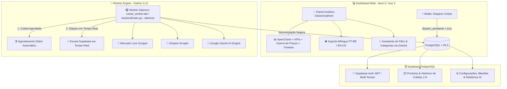

# 📈 MarketPulse AI — Plataforma SaaS de Inteligência de Mercado

> Plataforma Full-Stack de **Inteligência Competitiva e Análise de Mercado para E-Commerce** (Mercado Livre e Shopee), com Worker de Extração Resiliente (IP Residencial com bypass WAF), banco de dados **Multi-Tenant** com isolamento via Row Level Security (RLS) e diagnósticos estratégicos preditivos via **AI**.

---

## 🏛️ Visão Geral da Arquitetura



---

## ✨ Principais Funcionalidades

### 1. 🏢 Arquitetura Multi-Tenant com RLS (Supabase)

- **Isolamento de Dados Estrito:** Cada usuário/tenant autenticado via Supabase Auth acessa estritamente seus próprios produtos e configurações (`auth.uid() = user_id`).
- **Configurações Personalizadas por Nicho:** Termos de busca, blacklist de termos irrelevantes, regras de categorização e relatórios de IA salvos de forma independente por cliente.

### 2. 🎧 Worker Daemon Autônomo & Resiliente

- **Agendamento Diário:** Executa a rotina de coleta automaticamente em horários pré-configurados.
- **Disparo Instantâneo Sob Demanda:** Ao solicitar uma nova coleta diretamente no Dashboard web, o worker identifica o comando e inicia o processamento imediatamente.
- **Bypass de Bloqueios (Anti-Bot & WAF):** Utiliza `curl_cffi` (com impersonation de headers TLS/Chrome) e Playwright para contornar proteções do Cloudflare, Akamai e CAPTCHAs.

### 3. 🧠 Diagnósticos Executivos & IA Estratégica (Google Gemini)

- **Relatório Executivo Completo Bilíngue (PT 🇧🇷 / EN 🇺🇸):**
  - 🎯 _Recomendações Estratégicas & Oportunidades de Nicho_
  - 🏆 _Análise dos Top Vendedores & Lojas Líderes_
  - 🏷️ _Otimização de SEO, Palavras-chave e Títulos de Alta Conversão_
  - 📊 _Comparativo de Marketplaces (Mercado Livre vs Shopee) e Curvas de Preço_
- **Assistente de Filtros em Linguagem Natural:** Traduz buscas do usuário em filtros complexos de preços, categorias e ordenação.
- **Gerenciador de Categorias Inteligente:** Sugestão e classificação automática de produtos por palavras-chave com IA.

### 4. 📊 Dashboard Analítico Moderno (Nuxt 3 + Vue 3 + ApexCharts)

- **Design System Glassmorphism:** Interface fluida, moderna com paleta Dark Mode e micro-interações.
- **Cards de KPIs Financeiros:** Faturamento estimado, vendas totais, ticket médio, preço mínimo e máximo com indicadores de variação.
- **Módulos de Gráficos:**
  - _Market Share por Plataforma (Meli vs Shopee)_
  - _Distribuição de Preços (Histograma Interativo)_
  - _Preço vs Vendas Totais (Dispersão)_
  - _Top 10 Produtos Mais Vendidos_
  - _Top Vendedores por Faturamento_
  - _Volume de Vendas por Categoria_
- **Monitor de Guerra de Preços & Estratégia:** Comparação de descontos médios, produtos com corte de preço e alertas de precificação agressiva.
- **Linha do Tempo & Comparador de Coletas:** Acompanhamento de evolução de preços e curva de vendas entre coletas históricas (Data A vs Data B).
- **Catálogo Dinâmico com Paginação:** Tabela interativa com busca, ordenação rápida por qualquer coluna, filtro por range de preço, modais com detalhes do produto e listagem de anúncios do mesmo vendedor.

---

## 📂 Estrutura do Repositório

```text
biscuit_scraper/
│
├── iniciar_worker.bat               # 🚀 Atalho Windows para iniciar o Worker Daemon com 2 cliques
├── requirements.txt                 # 📦 Dependências Python do Backend
├── config_app.json                  # ⚙️ Configuração local de termos, blacklist e categorização
│
├── backend/                         # 🐍 Motor de Extração, IA e Sincronização (Python)
│   ├── main.py                      # Ponto de entrada CLI e modo Daemon
│   ├── config.py                    # Gerenciador central de configurações
│   ├── ai/
│   │   ├── categorizer.py           # Classificador e categorizador de produtos
│   │   └── insights_generator.py   # Gerador de relatórios executivos com Gemini
│   ├── scrapers/
│   │   ├── meli_scraper.py          # Extrator do Mercado Livre (Bronze ➔ Prata ➔ Ouro)
│   │   ├── shopee_scraper.py        # Extrator da Shopee (Bronze ➔ Prata ➔ Ouro)
│   │   └── login_session.py         # Gerenciamento de sessão e cookies de login
│   ├── scripts/
│   │   ├── init_user_configs.py     # Script de inicialização das configurações do tenant
│   │   └── setup_roles_and_users.py # Script auxiliar de configuração de usuários
│   └── utils/
│       ├── ai_engine.py             # Integração com API Google Gemini
│       ├── bot_detector.py          # Monitoramento e detecção de Anti-Bot/CAPTCHA
│       ├── limpar_dados_antigos.py  # Rotina de retenção e limpeza de dados
│       ├── relevancia.py            # Filtro de palavras-chave e relevância
│       └── supabase_client.py       # Integração com Supabase (PostgreSQL & Storage)
│
├── frontend/                        # 💻 Aplicação Web Nuxt 3 (Vue 3 / TypeScript)
│   ├── assets/css/main.css          # Estilos globais e tokens Glassmorphism
│   ├── components/                  # Componentes modulares do Dashboard
│   │   ├── AiExecutiveReport.client.vue # Módulo do Relatório Executivo de IA
│   │   ├── AiFilterAssistant.vue    # Assistente de filtros com linguagem natural
│   │   ├── CategoryManager.vue      # Gerenciador de categorias e palavras-chave
│   │   ├── DataTable.vue            # Tabela de produtos com paginação e busca
│   │   ├── KpiCards.vue             # Cards de indicadores financeiros
│   │   ├── Navbar.vue               # Barra de navegação e seletor de idioma
│   │   ├── PriceStrategyMonitor.vue # Painel de guerra e monitoramento de preços
│   │   ├── TimelineScrapeSelector.vue # Linha do tempo e comparação de datas
│   │   ├── TopProductsChart.client.vue # Gráficos analíticos ApexCharts
│   │   └── TrendingProductsTab.vue  # Aba de produtos virais e tendências
│   ├── composables/
│   │   ├── useAppI18n.ts            # Dicionário de traduções reativo (PT / EN)
│   │   ├── useConfirmDialog.ts      # Gerenciador de modais de confirmação
│   │   ├── useSupabase.ts           # Cliente Supabase Singleton
│   │   └── useToast.ts              # Sistema de notificações Toast
│   ├── i18n/locales/                # Arquivos JSON de localização (pt-BR.json, en-US.json)
│   ├── pages/
│   │   ├── index.vue                # Painel Principal do Dashboard
│   │   └── login.vue                # Tela de Login com autenticação
│   ├── nuxt.config.ts               # Configuração do framework Nuxt 3
│   └── package.json                 # Dependências e scripts do Frontend
│
├── database/                        # 🗄️ Modelagem e Configuração do Banco
│   └── database_setup.sql           # Schema SQL completo, índices e políticas RLS
│
├── supabase/                        # ⚡ Edge Functions do Supabase
│   └── functions/trigger-github/    # Webhook Edge Function
│
├── tests/                           # 🧪 Testes Automatizados
│   └── test_parsers.py              # Testes unitários dos parsers de preço e URLs
│
└── data/                            # 📁 Diretórios de dados locais (Bronze / Prata / Ouro)
```

---

## 🚀 Como Executar o Projeto

### Pré-requisitos

- **Python 3.10+**
- **Node.js 18+** e **npm**
- Conta e projeto configurados no **Supabase**
- Chave de API do **Google Gemini**

---

### 1. Configuração de Variáveis de Ambiente (`.env`)

Crie o arquivo `.env` na raiz do projeto com base no `.env.example`:

```ini
# Supabase
SUPABASE_URL=https://seu-projeto.supabase.co
SUPABASE_KEY=sua_service_role_key_ou_anon_key
SUPABASE_USER_ID=uuid_do_usuario_no_supabase

# Google Gemini AI
GEMINI_API_KEY=sua_chave_gemini_api

# Configurações do Frontend (Nuxt)
NUXT_PUBLIC_SUPABASE_URL=https://seu-projeto.supabase.co
NUXT_PUBLIC_SUPABASE_ANON_KEY=sua_anon_key
```

---

### 2. Configurar o Banco de Dados (Supabase)

1. Acesse o painel do seu projeto no **Supabase**.
2. Vá em **SQL Editor**.
3. Copie e execute todo o conteúdo de [`database/database_setup.sql`](file:///c:/Users/marsh/OneDrive/Desktop/trabalhos/projetos_pessoais/biscuit_scraper/database/database_setup.sql).
4. O schema com as tabelas `produtos`, `historico_coletas`, `configuracoes_scraper` e as políticas de segurança RLS estarão prontos para uso.

---

### 3. Iniciar o Frontend (Dashboard Nuxt 3)

```bash
cd frontend
npm install
npm run dev
```

O painel estará disponível em: `http://localhost:3000`

---

### 4. Iniciar o Backend & Worker

#### Opção A: Modo Daemon (Recomendado)

Mantém o robô ativo em segundo plano escutando pedidos de raspagem disparados pelo Dashboard e executando a rotina diária:

- **No Windows:** Basta dar 2 cliques no arquivo [`iniciar_worker.bat`](file:///c:/Users/marsh/OneDrive/Desktop/trabalhos/projetos_pessoais/biscuit_scraper/iniciar_worker.bat).
- **Ou via terminal:**

```bash
python backend/main.py --daemon
```

#### Opção B: Execução Manual Única (One-Shot)

Para realizar uma coleta imediata via terminal:

```bash
# Executar todos os marketplaces configurados
python backend/main.py --plataforma todos

# Ou executar apenas um marketplace específico
python backend/main.py --plataforma meli
python backend/main.py --plataforma shopee
```

---

## 🧪 Testes Automatizados

Para executar os testes unitários dos parsers:

```bash
pytest tests/
```

Para executar o linter do frontend:

```bash
cd frontend
npm run lint
```

---

## 📄 Licença

Distribuído sob licença proprietária. Todos os direitos reservados.
